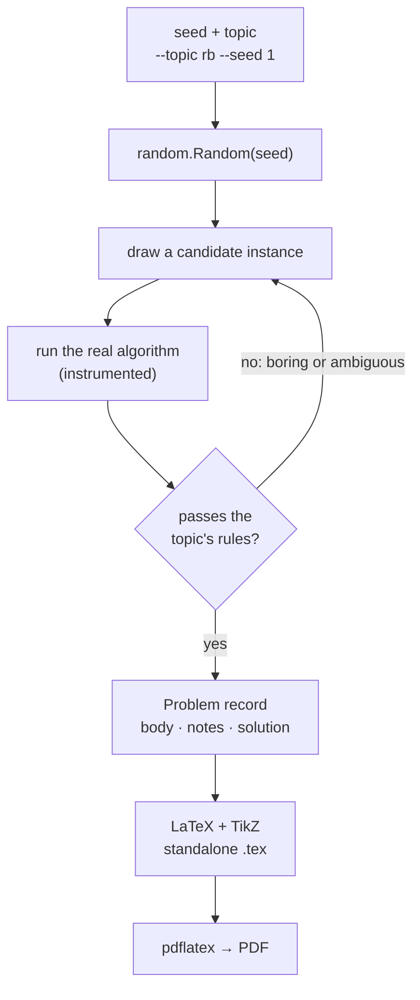

---
tags:
  - data-structures-and-algorithms
  - project
course: CS 253
---
# How the Generator Works
Back to [[archive/dsa-problem-generator/Index|Index]] · design and architecture

This note sits between the theory notes, which say *why* an algorithm works, and the source code, which says *exactly* what runs. It covers how a seed becomes a typeset, solved problem, and the design choices that make the output worth studying from.

---

## The pipeline



Four ideas carry the whole design.

### 1 · Seeds make every problem reproducible
`CS253ProblemGenerator(seed)` owns a single `random.Random(seed)`, and every random choice in the run comes from it. With no `--seed`, the tool draws one from the operating system and writes it into the document as `% seed=...`. So **any problem ever printed can be regenerated exactly.** Even `--topic random` is reproducible, because it picks a topic with the same generator. (That is also why the topic list's order is fixed: reordering it would change every seeded `random` problem.)

### 2 · Rejection sampling keeps only instructive instances
Solving constraints directly (for example, "find keys that force exactly one double rotation") is hard. Sampling and checking is easy. Each generator runs a loop like this:
```
repeat up to N times (N = 200–600):
    draw a random instance
    solve it and count the events that make it interesting
    if the counts pass the rules: return it
raise RuntimeError        # never quietly return a boring problem
```
The two sorting generators loop until they succeed instead, because their rules pass within a few draws.
The rules are the **teaching goal** written as a predicate:

| Topic | Kept only if… |
|---|---|
| `avl` | $\ge 2$ rotations on insert **and** $\ge 1$ on delete |
| `red_black` | $\ge 1$ insert rotation, $\ge 3$ insert recolorings, and some fix-up on delete |
| `two_four` | $\ge 1$ split on insert **and** $\ge 1$ merge or borrow on delete |
| `rb_to_24` | $\ge 2$ red nodes, so some black nodes absorb red children |
| `skip_list` | $\ge 5$ promotions, two towers of height $\ge 3$, tallest $\ge 4$ |
| `hashing` | $\ge 3$ collisions and a chain of length $\ge 3$ |
| `counting_sort` | $\ge 4$ distinct letters, one appearing $\ge 3$ times |
| `radix_sort` | 4-digit keys, and repeated ones digits so stability matters |
| `trie` | $\ge 3$ branching nodes, and a word to delete that shares a prefix |
| `kmp` | failure value $\ge 2$, $\ge 2$ fallbacks, $\ge 1$ match |
| `boyer_moore` | the good-suffix rule decides $\ge 1$ shift, and $\ge 1$ match |
| `huffman` | $\ge 3$ codeword lengths, a frequency tie, and fewer bits than fixed-length |
| `knapsack` | DP optimum **>** greedy-by-ratio value |
| `lcs` | $3 \le$ LCS length $<$ the shorter string |
| `edit_distance` | distance between 2 and 5 |
| `dijkstra` | every vertex reachable, $\ge 2$ distance improvements, $\ge 5$ distinct distances |
| `topological_sort` | $\ge 1$ step where several vertices are ready, so the tie-break matters (the DAG is fixed, so this topic has one problem) |
| `prim`, `kruskal` | $\ge 2$ edges rejected for closing a cycle |
| `ford_fulkerson` | max flow $\ge 10$, $\ge 3$ augmenting paths, $\ge 5$ edges used |

### 3 · Every problem has exactly one correct answer
An answer key only helps if there is a single right answer to compare against. Wherever an algorithm has a free choice, the problem statement fixes it:

| Where the choice is | How it is fixed |
|---|---|
| Huffman ties | smallest letter first, and the first tree removed is the left (0) child |
| Topological sort | Kahn's algorithm with a min-heap: smallest ready label first |
| Skip list coin flips | the generator flips the coins and prints the heights as a table |
| Augmenting paths | breadth-first search in a fixed neighbor order (Edmonds–Karp) |
| Graph layout | fixed vertex templates, and only the weights are random |

### 4 · Answers come from real data structures
Answers are never filled into text templates. The `structures/` package holds working implementations: CLRS-style **red-black** trees, **AVL**, **(2,4)** trees, **skip lists**, **tries**, and **union-find**. The generator modules implement the algorithms (Dijkstra, Prim, Kruskal, Edmonds–Karp, KMP, Boyer–Moore, the DP tables, and Huffman). They are **instrumented**, meaning they count the events a student has to show:

```python
def _set_color(self, node, color):        # structures/red_black.py
    if node.color != color:
        node.color = color
        self.recolor_count += 1           # every recoloring is counted
```

One run of the algorithm does two jobs. Its counters drive the **rejection rules** and get saved in the document as comments (`% insert_rotations=4`). Its final state becomes the **answer key**. The key is computed, never hand-derived, so it has no arithmetic slips.

---

## From data structure to document

**The `Problem` record.** Every generator returns the same five fields:
```python
@dataclass
class Problem:
    section_title: str          # "Graphs"
    subsection_title: str       # "Ford-Fulkerson Maximum Flow"
    body: str                   # the problem, in LaTeX
    notes: List[str]            # "augmentations=4", written as % comments
    solution: str = ""          # the Instructor Reference, if --with-solution
```
`Problem.to_latex(seed, with_solution)` wraps these in one shared preamble and header, so all 20 topics look alike.

**Tree layout.** `render.py` turns any tree into a TikZ drawing with explicit coordinates:
1. Number the leaves left to right in DFS order: $x = 0, 1, 2, \dots$
2. Center each internal node over its children: $x_{\text{parent}} = \operatorname{mean}(x_{\text{children}})$.
3. Set $y = -\text{depth}$, scale both axes, and emit `\node` and `\draw` commands.

One layout routine draws AVL, red-black, (2,4), trie, and Huffman trees. Only the node style (`blacknode`, `rednode`, `listnode`) and the edge labels (Huffman's 0/1) change.

**Graph layout.** Graph topics use hand-placed vertex templates, so vertices never overlap and edges rarely cross. `angle_to_label` puts each weight label on the side of its edge given by the edge's compass direction.

**Worksheets.** DP and sorting problems print the **empty table** the student fills in. The answer key prints the same table filled.

**Self-contained output.** Every `.tex` file compiles with plain `pdflatex`: no image files, no external tools, just `tikz`, `tikz-qtree`, and `amsmath`.

---

## Adding a topic
1. Write `problemgen/generators/<topic>.py` exposing `TOPIC`, `ALIASES`, and `generate(rng) -> Problem`.
2. Append it to `MODULES` in `generators/__init__.py`. Append rather than insert, so existing seeded `random` output doesn't change.
3. File it under a family in `CATEGORIES` in `cli.py`.
4. Add its rule to `RULES` in `tests/test_generators.py`. A test fails if any topic lacks one.

## Design trade-offs
- **Rejection sampling over a constraint solver.** It is simpler and easy to change. The cost is a retry loop, which is cheap at this problem size.
- **Fixed graph templates over random graphs.** A random graph gives unreadable drawings and sometimes disconnected problems. The cost is less variety in graph structure, since only the weights change.
- **Generated TikZ over images.** The output is text, diffable, and matches the rest of my LaTeX notes. The vault can't render TikZ, though, so the showcase notes embed SVGs compiled from the same TikZ.

## Related
- [[archive/dsa-problem-generator/Testing and Reproducibility|Testing and Reproducibility]]: how each of these claims is checked.
