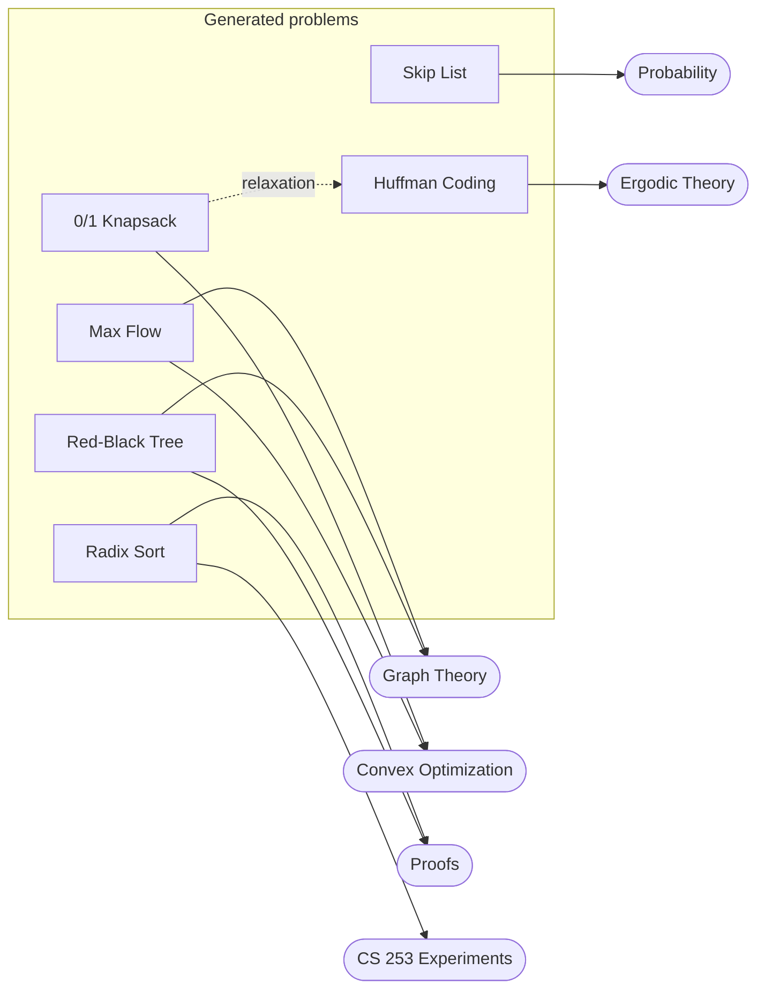

---
tags:
  - data-structures-and-algorithms
  - project
  - index
course: CS 253
---
# DSA Problem Generator
*CS 253* · Leo Winston · a command-line tool that turns a seed into a solved study problem

> [!abstract] Abstract
> A Python command-line tool that generates **unlimited, reproducible, non-trivial** practice problems for a data structures and algorithms course, each with a full worked solution typeset in LaTeX/TikZ. Each problem comes from a seed. The generator runs the real algorithm on random input and **rejects** instances that would be boring or ambiguous. It then writes a standalone `.tex` document with the problem, and optionally the answer key with tables and drawn trees and graphs. It covers **20 topics** in six families, from red-black trees to max flow.

---

## Why I built it
I built this to study for my **CS 253 – Data Structures and Algorithms** final.
1. **Not enough problems.** I started by looking up practice problems online, but I ran out of good ones quickly.
2. **RNG drills.** Then I started generating random insertion and deletion sequences myself, since that is what most tracing problems come down to.
3. **The problems were trivial, and I couldn't check them.** Random sequences often skip the interesting cases (no rotation, no tie, greedy happens to work). And after tracing an algorithm by hand, I had no answer key to check against.
4. **LaTeX.** I was already using LaTeX for my other classes, and I figured there had to be a way to generate these structures with good visuals so the solutions would look good too.
5. **A CLI.** I wanted a problem the moment I asked for one, so it's a single terminal command.

So the goal became: **generate the problem, solve it, and typeset both.**

```bash
python3 cs253_problem_generator.py --topic rb --seed 42 --with-solution > problem.tex
```

---

## The showcase problems
One problem from each of the six families, all from **seed 1**. Each note follows the same arc: the problem as generated, why the generator kept it, the big idea, the trace, the solution diagram, and how it connects to the rest of the vault.

| Family | Problem | Why it is non-trivial | Connects to |
|---|---|---|---|
| `trees` | [Red-Black Tree](generated-problems/trees/Red-Black%20Tree%20Problem.md) | 5 rotations and 17 recolorings across 10 inserts and 2 deletes | [Trees and Leaves](../../self-study/graph-theory/Theory/Trees%20and%20Leaves.md), [Proof by Induction](../proofs/Foundations%20of%20Math/Proof%20by%20Induction.md) |
| `data_structures` | [Skip List](generated-problems/data_structures/Skip%20List%20Problem.md) | prescribed tower heights up to 5, and deletes that need pointer updates | [Bernoulli and Binomial](../../self-study/probability/Notes/Bernoulli%20and%20Binomial.md), [Expected Value](../../self-study/probability/Notes/Expected%20Value.md) |
| `sorting` | [LSD Radix Sort](generated-problems/sorting/LSD%20Radix%20Sort%20Problem.md) | repeated digits, so stability decides the order | [BestSort experiment](../experiments/Data%20Structures%20and%20Algorithms/Best%20Sorting%20Algorithm%20Experimental%20Analysis.md) |
| `text_processing` | [Huffman Coding](generated-problems/text_processing/Huffman%20Coding%20Problem.md) | forced frequency ties, and 3 distinct codeword lengths | [Prefix Codes and Huffman Coding](../../self-study/ergodic-theory/Theory/Prefix%20Codes%20and%20Huffman%20Coding.md) |
| `dynamic_programming` | [0/1 Knapsack](generated-problems/dynamic_programming/0-1%20Knapsack%20Problem.md) | greedy by ratio gets 28, but the optimum is 33 | [Linear Programs](../../self-study/convex-optimization/topics/Linear%20Programs.md) |
| `graphs` | [Ford-Fulkerson Max Flow](generated-problems/graphs/Ford-Fulkerson%20Max%20Flow%20Problem.md) | 4 augmenting paths, certified by a min cut | [Matchings and Augmenting Paths](../../self-study/graph-theory/Theory/Matchings%20and%20Augmenting%20Paths.md) |



---

## Project notes
- [How the Generator Works](How%20the%20Generator%20Works.md): the pipeline from seed to PDF. Covers rejection sampling, canonical answers, instrumented solvers, and the TikZ layout engine.
- [Testing and Reproducibility](Testing%20and%20Reproducibility.md): how I know the answer keys are right. Covers brute-force checks, rule checks over 40 seeds, compile tests, and byte-identical reruns.

## All 20 topics

| Family | Topics (`--topic` name) |
|---|---|
| `trees` | `avl`, `red_black` (`rb`), `two_four` (`2-4`), `rb_to_24` |
| `data_structures` | `hashing`, `skip_list` |
| `sorting` | `counting_sort`, `radix_sort` |
| `text_processing` | `boyer_moore`, `kmp`, `trie`, `huffman` |
| `dynamic_programming` | `knapsack`, `lcs`, `edit_distance` |
| `graphs` | `dijkstra`, `topological_sort`, `prim`, `kruskal`, `ford_fulkerson` (`ff`) |

## Quick start
```bash
python3 cs253_problem_generator.py --list-topics                  # the 20 topics
python3 cs253_problem_generator.py --topic huffman                # random seed, problem only
python3 cs253_problem_generator.py --topic ff --seed 7 --with-solution > ff.tex
pdflatex ff.tex                                                   # standalone, no image files needed
python3 cs253_problem_generator.py --write-all DIR                # every topic, seeds 1–3, with solutions
```
With no `--seed`, the tool picks one and records it in the document as `% seed=...`, so any problem can be regenerated later.

## Layout
```
dsa-problem-generator/
├── Index.md                        ← this note
├── How the Generator Works.md
├── Testing and Reproducibility.md
├── cs253_problem_generator.py      ← CLI entry point
├── problemgen/
│   ├── cli.py  problem.py  latex.py  render.py
│   ├── generators/                 ← one module per topic (20)
│   └── structures/                 ← AVL, red-black, (2,4), skip list, trie, union-find
├── tests/                          ← 41 tests
└── generated-problems/
    └── <family>/                   ← note + .tex + .pdf + solution .svg
```

---

## Related
- [Data Structures and Algorithms experiments](../experiments/Data%20Structures%20and%20Algorithms/Index.md): my three CS 253 experimental analyses (HashMap, BestSort, trie autocomplete).
