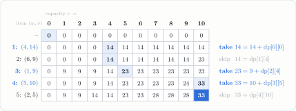

---
tags:
  - data-structures-and-algorithms
  - generated-problem
  - dynamic-programming
  - knapsack
course: CS 253
topic: knapsack
seed: 1
---
# 0/1 Knapsack Problem
Back to [Index](../../Index.md) · `dynamic_programming` · seed 1 · `--topic knapsack --seed 1`

> [!question] Problem · 0/1 Knapsack
> Given a knapsack of capacity $C = 10$ with weights $w = \{4, 6, 1, 5, 2\}$ and values $v = \{14, 9, 9, 10, 5\}$, complete the 0/1 knapsack dynamic-programming table and determine the optimal value.
> (The worksheet prints the $6 \times 11$ table with row 0 and column 0 already filled with zeros.)

> [!info]- Why the generator kept this instance
> **Rule:** the DP optimum must be **strictly greater** than the greedy-by-ratio value, and at least 10.
> **This instance:** greedy gets **28** and the DP gets **33**.
> Most random instances are solved correctly by the greedy heuristic. If the answer key doesn't differ from greedy, the problem can't tell a student who filled the table apart from one who guessed greedily.

---

## The big picture
Each item is either in or out, so there are $2^n$ subsets to try. Dynamic programming shrinks that to an $(n + 1) \times (C + 1)$ table. Cell $\mathrm{dp}[i][c]$ is the best value using only the first $i$ items with capacity $c$. Item $i$ is either **skipped** or **taken**:
$$
\boxed{\ \mathrm{dp}[i][c] = \max\!\big(\ \mathrm{dp}[i-1][c],\ \ v_i + \mathrm{dp}[i-1][c - w_i]\ \big)\ }\qquad (\text{second option only if } w_i \le c)
$$
Filling the table takes $O(nC)$ time. To recover the items, trace back from the bottom-right cell. If a cell differs from the cell above it, item $i$ was taken.

## Getting to the solution

**Why greedy fails.** Sort by value per unit weight:

| Item | 3 | 1 | 5 | 4 | 2 |
|---|:-:|:-:|:-:|:-:|:-:|
| $(w, v)$ | $(1, 9)$ | $(4, 14)$ | $(2, 5)$ | $(5, 10)$ | $(6, 9)$ |
| $v/w$ | 9.0 | 3.5 | 2.5 | 2.0 | 1.5 |
| Greedy | take | take | take | *no room* | *no room* |

Greedy fills 7 of the 10 units for a value of **28**. Item 5 fills a gap that blocks item 4. Leaving item 5 out makes room for item 4, which is worth more.

**Fill the table** row by row. Each row only reads the row directly above it.

## Solution

> [!success] Answer
> Optimal value $\mathrm{dp}[5][10] = \mathbf{33}$, using items $\{1, 3, 4\}$: weight $4 + 1 + 5 = 10$, value $14 + 9 + 10 = 33$.
> The shaded cells are the traceback path $(5,10) \to (4,10) \to (3,5) \to (2,4) \to (1,4) \to (0,0)$.

---

## Connections
This instance is a small example of **relaxation**, an idea that comes up across the vault.
- [Linear Programs](../../../../self-study/convex-optimization/topics/Linear%20Programs.md): allow fractions $x_i \in [0, 1]$ and knapsack becomes an LP. Greedy by ratio solves that LP *exactly*, filling the gap with $\tfrac35$ of item 4:
$$
\underbrace{28}_{\text{greedy}} \ \le\ \underbrace{33}_{\text{0/1 optimum}} \ \le\ \underbrace{28 + \tfrac35 \cdot 10 = 34}_{\text{LP relaxation}}
$$
The LP optimum sits at a vertex of the feasible polyhedron with at most one fractional item. Greedy is that LP solution with the fractional item dropped, and here that costs 5 against the true optimum.
- [EX10 – Relaxation Gap on a 10-Node Graph](../../../../self-study/convex-optimization/explorations/EX10%20-%20Relaxation%20Gap%20on%20a%2010-Node%20Graph.md): the same sandwich with the sparsest cut.
- [Prefix Codes and Huffman Coding](../../../../self-study/ergodic-theory/Theory/Prefix%20Codes%20and%20Huffman%20Coding.md): the same idea for codes. Dropping integrality from the codeword lengths gives the entropy bound. See also the [Huffman Coding Problem](../text_processing/Huffman%20Coding%20Problem.md).
- The generator's test checks the DP against brute force over all $2^n$ subsets.
- Other generator topics in `dynamic_programming`: `lcs`, `edit_distance`.

## Files
- Source: `knapsack-seed1.tex` (generator output, unchanged)
- Compiled: [knapsack-seed1.pdf](knapsack-seed1.pdf)
- Regenerate: `python3 cs253_problem_generator.py --topic knapsack --seed 1 --with-solution`
