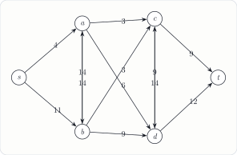
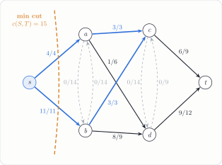

---
tags:
  - data-structures-and-algorithms
  - generated-problem
  - graphs
  - max-flow
course: CS 253
topic: ford_fulkerson
seed: 1
---
# Ford-Fulkerson Max Flow Problem
Back to [Index](../../Index.md) · `graphs` · seed 1 · `--topic ff --seed 1`

> [!question] Problem · Ford-Fulkerson Maximum Flow
> Starting with an initial flow of 0 on every edge, perform the Ford-Fulkerson algorithm to find the maximum flow from $s$ to $t$. For each iteration, show the augmenting path, its bottleneck capacity, and the updated flow values.
>
> 

> [!info]- Why the generator kept this instance
> **Rule:** max flow $\ge 10$, at least **3 augmenting paths**, and at least 5 edges carrying flow at the end.
> **This instance:** max flow 15, 4 augmentations, 8 edges carrying flow.
> The graph layout is a fixed six-vertex template, so the drawing is always clean. Only the capacities are random, drawn from 2–14 with at least one repeated value.

---

## The big picture
A **flow** assigns each edge an amount $0 \le f(e) \le c(e)$, and at every vertex other than $s$ and $t$ the flow in equals the flow out. Ford-Fulkerson grows the flow one path at a time:
```
f ← 0
while the residual graph has an s → t path P:
    b ← min residual capacity on P         # the bottleneck
    push b along P                         # a backward edge undoes earlier flow
return f
```
The **residual graph** has an edge $u \to v$ with capacity $c(u, v) - f(u, v)$ wherever flow can still be added, plus a backward edge $v \to u$ with capacity $f(u, v)$ wherever flow can be taken back.

> [!important] How the answer key picks paths
> The generator finds each path by **breadth-first search** (the Edmonds–Karp rule), checking neighbors in a fixed order. That makes the reference path sequence unique. A student who picks paths in another order still reaches max flow 15, but the individual edge flows can come out different.

## Getting to the solution

| # | Augmenting path | Residual capacities on the path | Bottleneck | Total flow |
|:-:|---|---|:-:|:-:|
| 1 | $s \to a \to c \to t$ | $4,\ 3,\ 9$ | **3** | 3 |
| 2 | $s \to a \to d \to t$ | $4 - 3 = 1,\ 6,\ 12$ | **1** | 4 |
| 3 | $s \to b \to c \to t$ | $11,\ 3,\ 9 - 3 = 6$ | **3** | 7 |
| 4 | $s \to b \to d \to t$ | $11 - 3 = 8,\ 9,\ 12 - 1 = 11$ | **8** | **15** |

After step 4, both edges out of $s$ are **saturated** ($4/4$ and $11/11$). The residual graph has no edge leaving $s$, so no path to $t$ is left and the algorithm stops.

## Solution



> [!success] Answer
> **Maximum flow $= 15$.** Final flows, as flow/capacity:
>
> | $s\!\to\!a$ | $s\!\to\!b$ | $a\!\to\!c$ | $a\!\to\!d$ | $b\!\to\!c$ | $b\!\to\!d$ | $c\!\to\!t$ | $d\!\to\!t$ |
> |:-:|:-:|:-:|:-:|:-:|:-:|:-:|:-:|
> | 4/4 | 11/11 | 3/3 | 1/6 | 3/3 | 8/9 | 6/9 | 9/12 |
>
> The four cross edges $a \leftrightarrow b$ and $c \leftrightarrow d$ carry $0$.
> **Certificate:** the cut $S = \{s\}$, $T = \{a, b, c, d, t\}$ has capacity $4 + 11 = 15 = |f|$. No flow can beat a cut, so this flow is maximum.

In the figure, blue edges are saturated, dashed gray edges carry nothing, and the orange line is the minimum cut. Here the bottleneck is at the source, which is the simplest kind of min cut. The next-best cut, $S = \{s, a, b\}$, has capacity 21.

---

## Connections
- [Matchings and Augmenting Paths](../../../../self-study/graph-theory/Theory/Matchings%20and%20Augmenting%20Paths.md): the same idea on a different structure. There, $M$ is maximum exactly when no $M$-augmenting path exists. Here, $f$ is maximum exactly when the residual graph has no augmenting path. Bipartite matching is max flow with unit capacities.
- [Hall's Theorem](../../../../self-study/graph-theory/Theory/Hall%27s%20Theorem.md): Hall's condition can be proved from max-flow min-cut applied to that unit-capacity network.
- [Cuts and Cut Density](../../../../self-study/graph-theory/Theory/Cuts%20and%20Cut%20Density.md): both notes rank cuts $(S, V - S)$. Here the score is total capacity crossing from $S$ to $T$, not density.
- [Paths, Connectivity, and Distance](../../../../self-study/graph-theory/Theory/Paths%2C%20Connectivity%2C%20and%20Distance.md): Edmonds–Karp always augments along a *shortest* residual path, which is what bounds it to $O(VE^2)$ time.
- [Linear Programs](../../../../self-study/convex-optimization/topics/Linear%20Programs.md): max flow is an LP, and min cut is its dual.
- The generator's test checks every flow against a brute-force minimum over all $2^4$ cuts and checks conservation at every vertex.
- Other generator topics in `graphs`: `dijkstra`, `topological_sort`, and `prim`/`kruskal` (see [Spanning Trees](../../../../self-study/graph-theory/Theory/Spanning%20Trees.md)).

## Files
- Source: `ford_fulkerson-seed1.tex` (generator output, unchanged)
- Compiled: [ford_fulkerson-seed1.pdf](ford_fulkerson-seed1.pdf)
- Regenerate: `python3 cs253_problem_generator.py --topic ff --seed 1 --with-solution`
- The solution figure is drawn from the generator's reference flows. The generator's own answer key for this topic is text only.
