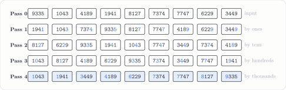

---
tags:
  - data-structures-and-algorithms
  - generated-problem
  - sorting
  - radix-sort
course: CS 253
topic: radix_sort
seed: 1
---
# LSD Radix Sort Problem
Back to [Index](../../Index.md) · `sorting` · seed 1 · `--topic radix --seed 1`

> [!question] Problem · LSD Radix Sort
> Use least significant digit (LSD) radix sort on the array
> $$[\,9335,\ 1043,\ 4189,\ 1941,\ 8127,\ 7374,\ 7747,\ 6229,\ 3449\,]$$
> Label each digit pass and preserve stability. (The worksheet prints an empty row for each of Passes 1–4.)

> [!info]- Why the generator kept this instance
> **Rule:** the largest key has at least 4 digits, and at least two keys share a ones digit with an earlier key, so that stability actually matters in the first pass.
> **This instance:** 4-digit keys, 9 keys with only 6 distinct ones digits ($9$ appears three times and $7$ twice).

---

## The big picture
Radix sort never compares two keys. It makes $d$ passes, one per digit from **least** to **most** significant. Each pass is a *stable* bucket sort on a single digit, which puts the keys in buckets $0$–$9$ and keeps their existing order inside each bucket.

> [!tip] Why least-significant first works
> After pass $k$ the array is sorted by its last $k$ digits. If two keys tie on the digit of pass $k + 1$, stability keeps them in the order the earlier passes gave them. By induction, after $d$ passes the whole key is sorted.
> $$T(n) = O\big(d\,(n + b)\big), \qquad d = 4,\ b = 10$$

## Getting to the solution
In each pass, read the array left to right and drop every key into the bucket for the current digit. Then read the buckets out from $0$ to $9$.

| Pass | Digit | Buckets (in order) |
|:-:|:-:|---|
| 1 | ones | **1**: 1941 · **3**: 1043 · **4**: 7374 · **5**: 9335 · **7**: 8127, 7747 · **9**: 4189, 6229, 3449 |
| 2 | tens | **2**: 8127, 6229 · **3**: 9335 · **4**: 1941, 1043, 7747, 3449 · **7**: 7374 · **8**: 4189 |
| 3 | hundreds | **0**: 1043 · **1**: 8127, 4189 · **2**: 6229 · **3**: 9335, 7374 · **4**: 3449 · **7**: 7747 · **9**: 1941 |
| 4 | thousands | **1**: 1043, 1941 · **3**: 3449 · **4**: 4189 · **6**: 6229 · **7**: 7374, 7747 · **8**: 8127 · **9**: 9335 |

Stability is doing the work in the last pass. $1043$ and $1941$ tie on the thousands digit, and so do $7374$ and $7747$. Pass 4 keeps them in the order Pass 3 set by the hundreds digit ($0 < 9$ and $3 < 7$), which is already correct.

## Solution

> [!success] Answer
> $$[\,1043,\ 1941,\ 3449,\ 4189,\ 6229,\ 7374,\ 7747,\ 8127,\ 9335\,]$$
> in $d = 4$ passes. The highlighted digit in each row is the one that pass sorted on.

---

## Connections
- [BestSort Experimental Analysis](../../../experiments/Data%20Structures%20and%20Algorithms/Best%20Sorting%20Algorithm%20Experimental%20Analysis.md): my hybrid sort uses this same LSD radix sort. It chooses radix when the $O(d \cdot N)$ cost beats $O(N\log N)$ on bounded integers. This problem is that algorithm traced by hand.
- [Proof by Induction](../../../proofs/Foundations%20of%20Math/Proof%20by%20Induction.md): the correctness argument above is an induction on the number of passes.
- Other generator topics in `sorting`: `counting_sort`, the stable single-digit subroutine used in every pass.

## Files
- Source: `radix_sort-seed1.tex` (generator output, unchanged)
- Compiled: [radix_sort-seed1.pdf](radix_sort-seed1.pdf)
- Regenerate: `python3 cs253_problem_generator.py --topic radix --seed 1 --with-solution`
