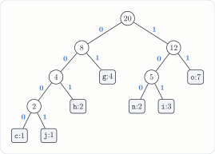

---
tags:
  - data-structures-and-algorithms
  - generated-problem
  - text-processing
  - huffman-coding
  - information-theory
course: CS 253
topic: huffman
seed: 1
---
# Huffman Coding Problem
Back to [Index](../../Index.md) · `text_processing` · seed 1 · `--topic huffman --seed 1`

> [!question] Problem · Huffman Coding
> Consider the string `onongigohciigojgohoo` of length 20.
> **(a)** Give the frequency of each character.
> **(b)** Build the Huffman tree. At each step remove the two trees of smallest total frequency. When frequencies tie, remove first the tree containing the alphabetically smallest character. The first tree removed becomes the left child. Left edges are labeled 0 and right edges 1.
> **(c)** List the codeword for each character.
> **(d)** How many bits does the Huffman encoding of the string use? Compare this with a fixed-length code, which needs 3 bits per character.
> **(e)** Decode the bit string `00110101001100` using your tree.

> [!info]- Why the generator kept this instance
> **Rule:** the string has 20–32 characters, the codewords have at least **3 distinct lengths**, at least one frequency **ties**, and Huffman beats the fixed-length code.
> **This instance:** 7 characters, lengths $\{2, 3, 4\}$, two tied pairs ($c, j$ at 1 and $h, n$ at 2), and 51 bits against 60.

---

## The big picture
Huffman's algorithm builds an optimal **prefix-free** code greedily. It keeps merging the two lightest trees until one tree is left. Rare characters end up deep in the tree and get long codewords, and common ones get short codewords.

> [!important] The tie-break is what makes this gradable
> With ties, Huffman's algorithm can build several different trees that all have the same optimal cost. Each tree gives different codewords, so an answer key would be ambiguous. The problem fixes that with a rule: break ties by the alphabetically smallest character in each tree, and make the first tree removed the left child. Now there is exactly one correct tree. The generator also *requires* a tie, so this instance tests the rule.

## Getting to the solution

**(a) Frequencies**

| Character | `c` | `g` | `h` | `i` | `j` | `n` | `o` |
|---|:-:|:-:|:-:|:-:|:-:|:-:|:-:|
| **Frequency** | 1 | 4 | 2 | 3 | 1 | 2 | 7 |

**(b) Merges.** The weights in parentheses are total frequencies.

| Step | First removed → **0** | Second removed → **1** | New tree | Tie-break used? |
|:-:|---|---|---|---|
| 1 | `c` (1) | `j` (1) | `cj` (2) | `c` < `j` |
| 2 | `cj` (2) | `h` (2) | `chj` (4) | three trees of weight 2: `cj`, `h`, `n`. Take `c`, then `h` |
| 3 | `n` (2) | `i` (3) | `in` (5) | — |
| 4 | `chj` (4) | `g` (4) | `cghj` (8) | `c` < `g` |
| 5 | `in` (5) | `o` (7) | `ino` (12) | — |
| 6 | `cghj` (8) | `ino` (12) | root (20) | — |

## Solution

**(c) Codewords**, read from the root down

| Char | Freq | Codeword | Bits |
|:-:|:-:|:-:|:-:|
| `g` | 4 | `01` | 8 |
| `o` | 7 | `11` | 14 |
| `h` | 2 | `001` | 6 |
| `n` | 2 | `100` | 6 |
| `i` | 3 | `101` | 9 |
| `c` | 1 | `0000` | 4 |
| `j` | 1 | `0001` | 4 |
| | | **Total** | **51** |

> [!success] Answer
> **(d)** Huffman uses **51 bits**. The fixed-length code uses $20 \times 3 = 60$ bits, so Huffman saves **9 bits**.
> **(e)** `001 · 101 · 01 · 001 · 100` → **`highn`**

---

## Connections
The ergodic theory notes prove *why* Huffman is optimal. This problem shows it on real data.
- [Prefix Codes and Huffman Coding](../../../../self-study/ergodic-theory/Theory/Prefix%20Codes%20and%20Huffman%20Coding.md): the greedy proof (Lemmas 1–2 and optimal substructure) and the entropy bound. Check them here with $p = \tfrac{1}{20}(1, 4, 2, 3, 1, 2, 7)$:
$$
H(p) = -\sum_a p_a \log_2 p_a \approx 2.502 \ \le\ \E[L] = \tfrac{51}{20} = 2.55 \ <\ H(p) + 1
$$
Across the whole string that is $51$ bits against the lower bound $20\,H(p) \approx 50.03$, so the code is within one bit of the entropy limit. Kraft holds with equality, $2 \cdot 2^{-2} + 3 \cdot 2^{-3} + 2 \cdot 2^{-4} = 1$, so the tree is full.
- [EX01 – Huffman Code and the Entropy Bound](../../../../self-study/ergodic-theory/Examples/EX01%20-%20Huffman%20Code%20and%20the%20Entropy%20Bound.md): the same check on my notebook's six-symbol code.
- [Noiseless and Memoryless Channels](../../../../self-study/ergodic-theory/Theory/Noiseless%20and%20Memoryless%20Channels.md): treating the string as draws from a memoryless source is the model under which $H(p)$ is the right benchmark.
- The generator's own test compares every Huffman cost against a brute-force search over all code-length vectors that satisfy Kraft. That is the optimality theorem checked by computer (see [Testing and Reproducibility](../../Testing%20and%20Reproducibility.md)).
- Other generator topics in `text_processing`: `kmp`, `boyer_moore`, `trie`.

## Files
- Source: `huffman-seed1.tex` (generator output, unchanged)
- Compiled: [huffman-seed1.pdf](huffman-seed1.pdf)
- Regenerate: `python3 cs253_problem_generator.py --topic huffman --seed 1 --with-solution`
