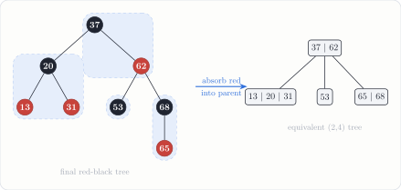

---
tags:
  - data-structures-and-algorithms
  - generated-problem
  - trees
  - red-black-tree
course: CS 253
topic: red_black
seed: 1
---
# Red-Black Tree Problem
Back to [Index](../../Index.md) · `trees` · seed 1 · `--topic rb --seed 1`

> [!question] Problem · Red-Black Tree Tracing Challenge
> Start from an empty red-black tree. Insert the keys
> $$77,\ 13,\ 37,\ 20,\ 68,\ 62,\ 65,\ 88,\ 53,\ 31$$
> Then remove the keys $88,\ 77$, showing every recoloring and rotation needed to restore the red-black invariants.

> [!info]- Why the generator kept this instance
> **Rule:** at least 1 rotation and 3 recolorings during the inserts, and at least one rotation or recoloring during the deletes.
> **This instance:** 4 insert rotations, 14 insert recolorings, 1 delete rotation, 3 delete recolorings.
> A random key sequence often inserts with no rotations at all, so without this check many "problems" would be plain BST inserts.

---

## The big picture
A red-black tree is a binary search tree that stays balanced by keeping three rules:

| Invariant | Meaning |
|---|---|
| **Root** | the root is black |
| **Red** | a red node never has a red child |
| **Black depth** | every root-to-leaf path passes the same number of black nodes |

Every insert places a **red** leaf, so only the red rule can break. The fix depends on the new node's **uncle**:
- **Uncle red** → recolor (parent and uncle black, grandparent red) and move the problem two levels up.
- **Uncle black** → rotate once (straight line) or twice (zig-zag), then recolor. Done.

Deleting a black node leaves one path a black short (a "double black"). The fix depends on the **sibling** and its children.

> [!tip] Think in (2,4) trees
> A black node with its red children is one node of a (2,4) tree. A red uncle is a 4-node that **splits**. A black uncle means there is room, so the red node just gets **rearranged** inside its 3-node. See the figure below.

## Getting to the solution

| # | Operation | What happens | Rot. | Recol. |
|:-:|---|---|:-:|:-:|
| 1 | insert 77 | new root, colored black | 0 | 1 |
| 2 | insert 13 | red child of a black node, nothing to fix | 0 | 0 |
| 3 | insert 37 | $77 \to 13 \to 37$ is a zig-zag with a black (nil) uncle: rotate left at 13, then right at 77. 37 becomes the black root | **2** | 2 |
| 4 | insert 20 | parent 13 and uncle 77 are both red: recolor them black, 37 red, then the root goes back to black | 0 | 4 |
| 5 | insert 68 | red child of black 77 | 0 | 0 |
| 6 | insert 62 | $77 \to 68 \to 62$ is a straight line with a black uncle: rotate right at 77 | **1** | 2 |
| 7 | insert 65 | parent 62 and uncle 77 are red: recolor, and 68 turns red | 0 | 3 |
| 8 | insert 88 | red child of black 77 | 0 | 0 |
| 9 | insert 53 | red child of black 62 | 0 | 0 |
| 10 | insert 31 | $13 \to 20 \to 31$ is a straight line with a black (nil) uncle: rotate left at 13 | **1** | 2 |
| 11 | delete 88 | red leaf, just remove it | 0 | 0 |
| 12 | delete 77 | black leaf, which leaves a double black under 68. Sibling 62 is black with a red outer child 53: rotate right at 68. 62 takes 68's red, and 68 and 53 turn black | **1** | 3 |
| | | **Totals** | **5** | **17** |

The totals match the counts the generator stored with the problem: $4 + 1$ rotations and $14 + 3$ recolorings.

## Solution

> [!success] Answer
> Final tree (● black, ○ red):
> $$37^{\bullet}\big(\,20^{\bullet}(13^{\circ},\,31^{\circ}),\ \ 62^{\circ}\big(53^{\bullet},\ 68^{\bullet}(65^{\circ},\,\cdot)\big)\big)$$
> Every root-to-nil path passes exactly **2** black nodes. Grouping each black node with its red children gives the (2,4) tree $[37 \mid 62]$ over $[13 \mid 20 \mid 31]$, $[53]$, $[65 \mid 68]$.

> [!note] A seed detail
> The seed-1 `rb_to_24` problem in the generator's output draws the same first eight keys $77, 13, \dots, 88$, because both generators pull from `random.Random(1)` in the same way. That conversion problem is exactly this tree after step 8.

---

## Connections
- [Trees and Leaves](../../../../self-study/graph-theory/Theory/Trees%20and%20Leaves.md): a red-black tree is a tree in the graph sense. The final tree has 8 nodes and $e(T) = 8 - 1 = 7$ edges.
- [Proof by Induction](../../../proofs/Foundations%20of%20Math/Proof%20by%20Induction.md): the balance guarantee comes from an induction on height. A subtree with black height $b$ has at least $2^{b} - 1$ keys, and the red rule gives $b \ge h/2$, so
$$
h \le 2\log_2(n + 1).
$$
- [Trie-Based Autocomplete](../../../experiments/Data%20Structures%20and%20Algorithms/Autocomplete%20Experimental%20Analysis.md): another tree structure from CS 253, measured instead of traced.
- Other generator topics in `trees`: `avl`, `two_four`, `rb_to_24`.

## Files
- Source: `red_black-seed1.tex` (generator output, unchanged)
- Compiled: [red_black-seed1.pdf](red_black-seed1.pdf)
- Regenerate: `python3 cs253_problem_generator.py --topic rb --seed 1 --with-solution`
