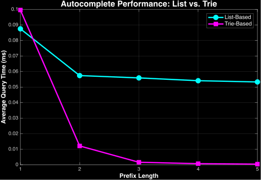

---
tags:
  - data-structures-and-algorithms
  - experiment
course: CS 253
date: 2026-04
---
# Trie-Based Autocomplete Experimental Analysis
Back to [Index](Index.md)

*CS 253* · Leo Winston · April 2026

## Plot

*Comparison of average query times (in milliseconds) between the List-based and Trie-based autocomplete implementations across prefix lengths 1 through 5. (Graph produced via MATLAB)*

## Analysis
As the prefix length increases, the Trie's average query time drops exponentially. Query time drops from 0.0996 ms at length 1 to only 0.0004 ms at length 5. In contrast, the List-based approach remains relatively flat, only decreasing slightly from 0.0875 ms to 0.0533 ms across the same lengths.

For the Trie, runtime is heavily dependent on the number of matching words because a larger number of matches, like 484.25 for length 1 prefixes, requires a very wide depth-first search traversal to find valid suggestions. The List approach is much less affected by the number of matches, as its runtime is consistently dominated by the $\mathcal{O}(n)$ requirement of scanning all 10,000 words in the dictionary regardless of how many actually match the prefix.

The Trie vastly outperforms the List-based approach for prefixes of lengths 2 through 5, because as the prefix lengthens, the Trie narrows the search space and bypasses the vast majority of the dictionary.

The List-based approach slightly outperforms the Trie only for prefixes of length 1, which match an average of 484 words. Since the Trie must execute a wide depth-first search traversal across many branches for these short prefixes, it is slower than the straightforward linear iteration and string comparison of the List approach.

## Experimental Data
*Seed: 2785990. The table below represents the average number of matches and the average query execution time (in milliseconds) for both the list-based and trie-based autocomplete implementations, categorized by the length of the query prefix.*

| Prefix Length | Avg Matches | List Time (ms) | Trie Time (ms) |
|:-:|:-:|:-:|:-:|
| 1 | 484.25 | 0.0875 | 0.0996 |
| 2 | 84.70 | 0.0574 | 0.0121 |
| 3 | 13.35 | 0.0559 | 0.0016 |
| 4 | 4.65 | 0.0541 | 0.0007 |
| 5 | 2.25 | 0.0533 | 0.0004 |

*Summary of Autocomplete Performance by Prefix Length*
