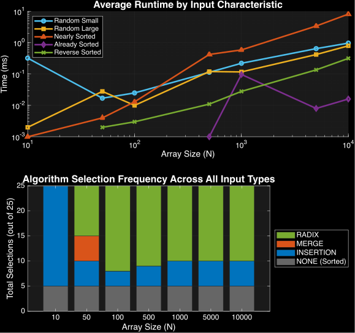

---
tags:
  - data-structures-and-algorithms
  - experiment
course: CS 253
date: 2026-04
---
# BestSort Experimental Analysis
Back to [Index](Index.md)

*CS 253* · Leo Winston · April 2026

> [!abstract] Abstract
> This project presents the implementation and experimental evaluation of `BestSort`, a hybrid sorting algorithm to optimize performance across different dataset features. The analysis algorithm computes key metrics, including array size, adjacent inversion ratio, and maximum digit count to select between Insertion Sort, Merge Sort, and an explicitly implemented Least Significant Digit Radix Sort. The selection policy applies a cost model to prioritize Insertion Sort for small or nearly sorted arrays, and it balances the $\mathcal{O}(d \cdot N)$ efficiency of Radix Sort against the $\mathcal{O}(N \log N)$ scaling of Merge Sort for larger datasets. Experimental results across various input distributions confirm that this approach successfully minimizes runtime.

## Visualizations

*Top: Log-log plot of average runtime vs. array size ($N$) across five input types. Bottom: Stacked bar chart detailing the policy's algorithm selection frequency. (Graphs produced via MATLAB)*

## Analysis
BestSort effectively selects algorithms by taking array size, inversion ratios, and digit counts into account. For all small arrays ($N \le 10$), insertion sort was chosen due to its simplicity, and because it is the best at nearly sorted arrays; the adjacent inversion ratio was below the 0.10 threshold, allowing it to achieve $\mathcal{O}(N)$ efficiency. Radix sort was picked most for random and reverse-sorted datasets because its $\mathcal{O}(d \cdot N)$ time complexity outperforms $\mathcal{O}(N \log N)$ on bounded integers as $N$ grows. Merge sort was selected only for "Random large values" at $N=50$ because the large digit count ($d=6$) of those numbers made Radix sort's multiple passes more expensive than Merge sort's efficient comparisons at that specific, small array size.

The policy behaved perfectly as expected for "Already Sorted" inputs, it was great at identifying the existing order during the $\mathcal{O}(N)$ analysis pass and it correctly marked when no sorting was needed. However, a slightly unexpected outcome occurred in the "Nearly Sorted" arrays at $N=100$ and $N=500$, where Radix sort was chosen three times. The randomized swap function used to generate the data likely pushed the inversion ratio a small amount above the 0.10 threshold, causing the policy to use the general cost model rather than forcing Insertion sort.

## Experimental Data
*Seed: 2785990. The table below represents 25 total trials per $N$ (5 trials across 5 input conditions). "avg ms" represents the average runtime of the algorithm.*

| n | avg ms | NONE | INSERTION | MERGE | RADIX |
|--:|--:|--:|--:|--:|--:|
| **Random small values** | | | | | |
| 10 | 0.322 | 0 | 5 | 0 | 0 |
| 50 | 0.017 | 0 | 0 | 0 | 5 |
| 100 | 0.025 | 0 | 0 | 0 | 5 |
| 500 | 0.114 | 0 | 0 | 0 | 5 |
| 1000 | 0.221 | 0 | 0 | 0 | 5 |
| 5000 | 0.647 | 0 | 0 | 0 | 5 |
| 10000 | 0.971 | 0 | 0 | 0 | 5 |
| **Random large values** | | | | | |
| 10 | 0.002 | 0 | 5 | 0 | 0 |
| 50 | 0.028 | 0 | 0 | 5 | 0 |
| 100 | 0.010 | 0 | 0 | 0 | 5 |
| 500 | 0.120 | 0 | 0 | 0 | 5 |
| 1000 | 0.117 | 0 | 0 | 0 | 5 |
| 5000 | 0.419 | 0 | 0 | 0 | 5 |
| 10000 | 0.797 | 0 | 0 | 0 | 5 |
| **Nearly sorted** | | | | | |
| 10 | 0.001 | 0 | 5 | 0 | 0 |
| 50 | 0.004 | 0 | 5 | 0 | 0 |
| 100 | 0.013 | 0 | 3 | 0 | 2 |
| 500 | 0.422 | 0 | 4 | 0 | 1 |
| 1000 | 0.589 | 0 | 5 | 0 | 0 |
| 5000 | 3.400 | 0 | 5 | 0 | 0 |
| 10000 | 8.167 | 0 | 5 | 0 | 0 |
| **Already sorted** | | | | | |
| 10 | 0.000 | 5 | 0 | 0 | 0 |
| 50 | 0.000 | 5 | 0 | 0 | 0 |
| 100 | 0.000 | 5 | 0 | 0 | 0 |
| 500 | 0.001 | 5 | 0 | 0 | 0 |
| 1000 | 0.097 | 5 | 0 | 0 | 0 |
| 5000 | 0.008 | 5 | 0 | 0 | 0 |
| 10000 | 0.016 | 5 | 0 | 0 | 0 |
| **Reverse sorted** | | | | | |
| 10 | 0.000 | 0 | 5 | 0 | 0 |
| 50 | 0.002 | 0 | 0 | 0 | 5 |
| 100 | 0.003 | 0 | 0 | 0 | 5 |
| 500 | 0.011 | 0 | 0 | 0 | 5 |
| 1000 | 0.028 | 0 | 0 | 0 | 5 |
| 5000 | 0.136 | 0 | 0 | 0 | 5 |
| 10000 | 0.316 | 0 | 0 | 0 | 5 |
