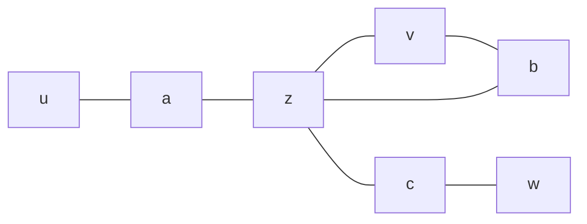

# EX01 — Short-Circuiting a Joined Path
Back to [[self-study/graph-theory/Index|Index]]

> [!question] Problem
> In a graph with edges $ua$, $az$, $zv$, $vb$, $bz$, $zc$, $cw$, take the $uv$ path $P = u\,a\,z\,v$ and the $vw$ path $Q = v\,b\,z\,c\,w$.
> (a) Is the concatenation $PQ$ a $uw$ path?
> (b) Find the $uw$ path it contains.

## Strategy
1. A path needs **distinct** vertices, so look for a repeat.
2. ✎ Short circuit: cut out the loop between the two copies of the repeated vertex.

## Solution
**(a)** Gluing gives $u\,a\,z\,v\,b\,z\,c\,w$. The vertex $z$ appears twice, so it fails distinctness. ✎ It "is not distinct, should short circuit."

**(b)** Delete everything strictly after the first $z$ up to the second $z$, which removes the loop $z\,v\,b\,z$:
$$
u\,a\,\underbrace{z\,v\,b}_{\text{cut}}\,z\,c\,w \ \longrightarrow\ \boxed{u\,a\,z\,c\,w}
$$
Each consecutive pair $ua$, $az$, $zc$, $cw$ is still an edge, and all vertices are distinct.

This matches the general proof. For $w_1 \dots w_a\, z\, w_{a+2} \dots w_b\, z\, w_{b+2} \dots w_r$, the shorter sequence $w_1 \dots w_a\, z\, w_{b+2} \dots w_r$ still works. So a *minimal* sequence has no repeats.

## Takeaways
- Reachability is **transitive**: joining a $uv$ path and a $vw$ path always leaves a $uw$ path inside.
- This is why $\sim$ ("there is a path") is an equivalence relation.

## Related topics
- [[Paths, Connectivity, and Distance]]
