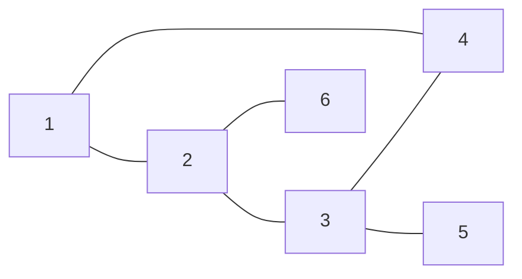

# EX02 — Checking a Graph for Trees
Back to [[self-study/graph-theory/Index|Index]]

> [!question] Problem
> $G$ has $V = \{1, \dots, 6\}$ and $E = \{12, 23, 34, 41, 35, 26\}$.
> (a) Is $G$ a tree?
> (b) Find a spanning tree $T$ and its leaves.
> (c) Check $e(T) = \card{T} - 1$ by removing leaves.

## Strategy
1. A tree must be connected and acyclic. Look for a subgraph isomorphic to some $C_n$.
2. Remove one edge from each cycle to get a spanning tree.

## Solution
**(a)** ✎ Let $V' = \{1, 2, 3, 4\}$ and $E' = \{12, 23, 34, 41\}$. Then $G' = (V', E') \subseteq G$ is isomorphic to $C_4$, so $G$ is not acyclic and $\boxed{G \text{ is not a tree}}$. As a count check, $e(G) = 6 \ne 5 = \card{G} - 1$.

**(b)** Remove $41$ to get $T$ with $E(T) = \{12, 23, 34, 35, 26\}$.

| Vertex | 1 | 2 | 3 | 4 | 5 | 6 |
|---|---|---|---|---|---|---|
| $d_T$ | 1 | 3 | 3 | 1 | 1 | 1 |

The leaves are $\boxed{1, 4, 5, 6}$. Removing $12$, $23$, or $34$ instead gives a different spanning tree.

**(c)** Remove leaves one at a time, as in the induction:

| Remove | Vertices left | Edges left |
|---|---|---|
| — | 6 | 5 |
| 1 | 5 | 4 |
| 4 | 4 | 3 |
| 5 | 3 | 2 |
| 6 | 2 | 1 |

Each step removes one vertex and one edge, so the gap $\card{T} - e(T) = 1$ never changes.

## Takeaways
- To show a graph is not a tree, one cycle is enough. For a connected graph, the count $e(G) > \card{G} - 1$ gives the same verdict.
- Spanning trees are not unique.

## Related topics
- [[Trees and Leaves]]
- [[Spanning Trees]]
