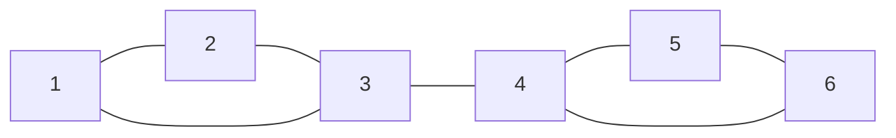

# EX07 — Sweep Cut on Two Joined Triangles
Back to [[self-study/graph-theory/Index|Index]]

> [!question] Problem
> Triangles $\{1, 2, 3\}$ and $\{4, 5, 6\}$ are joined by the bridge $3$–$4$, like the blue/red clusters in my sketch.
> Run steps ①–④ and check $\lambda_2 \le \phi_G \le 4\sqrt{\Delta(G)\lambda_2}$.



## Solution
① Build $L_G$ and solve:
```python
import numpy as np
E = [(1,2),(1,3),(2,3),(3,4),(4,5),(4,6),(5,6)]
A = np.zeros((6, 6))
for i, j in E:
    A[i-1, j-1] = A[j-1, i-1] = 1
L = np.diag(A.sum(1)) - A
w, v = np.linalg.eigh(L)   # w = [0, 0.438, 3, 3, 3, 4.562]
fiedler = v[:, 1]          # ±[0.465, 0.465, 0.261, −0.261, −0.465, −0.465]
```
So $\lambda_2 = \tfrac{5 - \sqrt{17}}{2} \approx 0.438$. The vector's sign may flip between solvers.

② Sort the vertices by their Fiedler entries: $5, 6, 4, 3, 1, 2$ (5 and 6 tie, as do 1 and 2).

③–④ Check the density of each prefix set, with $n = 6$:

| $k$ | $A_k$ | edges cut | $\phi = 6\cdot\frac{\text{cut}}{k(6-k)}$ |
|---|---|---|---|
| 1 | $\{5\}$ | 2 | 2.40 |
| 2 | $\{5, 6\}$ | 2 | 1.50 |
| 3 | $\{4, 5, 6\}$ | 1 | $\boxed{0.67}$ |
| 4 | $\{3, 4, 5, 6\}$ | 2 | 1.50 |
| 5 | $\{1, 3, 4, 5, 6\}$ | 2 | 2.40 |

The sweep returns $A_3 = \{4, 5, 6\}$. It cuts only the bridge, and a brute-force search over all $2^6$ subsets confirms that it is the sparsest cut.

**Check:** $\lambda_2 = 0.438 \le \phi_G = 0.667 \le 4\sqrt{3 \cdot 0.438} \approx 4.59$. ✓

## Takeaways
- The Fiedler vector's sign change marks the bridge: $+0.261$ at vertex 3, $-0.261$ at vertex 4.
- The sweep checked 5 cuts instead of 62, and here it found the optimum.

## Related topics
- [[Spectral Clustering Algorithm]]
- [[Sparsest Cut]]
- [[Spectral Gap and Fiedler Vector]]
- [[EX08 - Whisker Cut Versus Regularized Clustering]] (a graph where this sweep fails)
