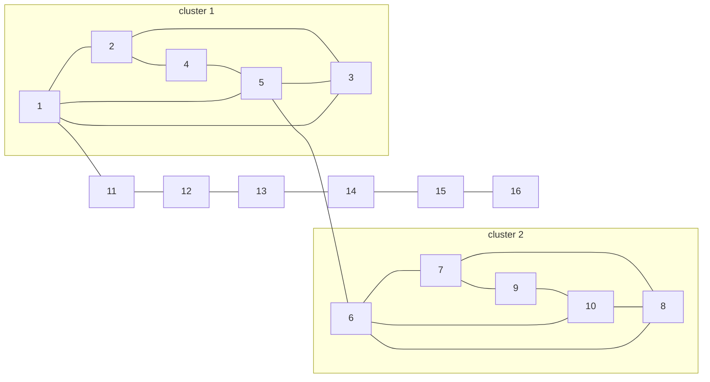

# EX08 — Whisker Cut Versus Regularized Clustering
Back to [[self-study/graph-theory/Index|Index]]

> [!question] Problem
> Take the two 5-vertex clusters from [[EX10 - Relaxation Gap on a 10-Node Graph]], $\{1, \dots, 5\}$ and $\{6, \dots, 10\}$, joined by the bridge $5$–$6$. Hang the path $1$–$11$–$12$–$13$–$14$–$15$–$16$ off vertex 1. Split the graph at the sign of the second eigenvector using
> (a) vanilla $L_G$, (b) the normalized Laplacian ($\tau = 0$), and (c) the regularized $\mathcal L_\tau$ with $\tau$ equal to the average degree.



## Solution
```python
import numpy as np
E = [(1,2),(1,3),(2,3),(2,4),(3,5),(4,5),(1,5),
     (6,7),(6,8),(7,8),(7,9),(8,10),(9,10),(6,10),(5,6),
     (1,11),(11,12),(12,13),(13,14),(14,15),(15,16)]
n = 16
A = np.zeros((n, n))
for i, j in E:
    A[i-1, j-1] = A[j-1, i-1] = 1
d = A.sum(1)
tau = d.mean()                                  # 42/16 = 2.625

def split(M, scale):                            # side of the sign split holding vertex 6
    x = np.linalg.eigh(M)[1][:, 1] / scale
    return [i+1 for i in range(n) if np.sign(x[i]) == np.sign(x[5])]

L  = np.diag(d) - A
Ln = np.eye(n) - np.diag(d**-.5) @ A @ np.diag(d**-.5)
At = A + tau / n
Dt = d + tau
Lt = np.eye(n) - np.diag(Dt**-.5) @ At @ np.diag(Dt**-.5)

print(split(L, 1))              # [1..10]  -> path cut off
print(split(Ln, np.sqrt(d)))    # [1..10]  -> path cut off
print(split(Lt, np.sqrt(Dt)))   # [6..10]  -> the two clusters
```

| Method | $\lambda_2$ | Split | Result |
|---|---|---|---|
| (a) vanilla $L_G$ | 0.071 | $\{11,\dots,16\}$ vs the rest | ✗ cuts off the path |
| (b) normalized, $\tau = 0$ | 0.035 | $\{11,\dots,16\}$ vs the rest | ✗ cuts off the path |
| (c) regularized, $\tau = 2.625$ | 0.520 | $\{6,\dots,10\}$ vs the rest | ✓ finds the clusters |

**Why (a) fails.** Its objective really does prefer the path. Compare the two cuts, each crossing one edge:

| Cut | density $\phi$ | conductance | CoreCut$_\tau$ |
|---|---|---|---|
| path $\{11,\dots,16\}$ | $\boxed{0.267}$ | 0.091 | 0.405 |
| cluster $\{6,\dots,10\}$ | 0.291 | $\boxed{0.067}$ | $\boxed{0.356}$ |

The density $\phi$ is lowest for the path, and the vanilla sweep agrees: it returns the path, which brute force confirms is $\phi_G$. Conductance divides by degree totals and prefers the clusters, but the normalized eigenvector in (b) still concentrates on the path. CoreCut$_\tau$ adds $\tfrac{\tau}{n}\card{S}\card{V - S}$ to the cut and uses $d_i + \tau$ in the degree totals. Under it the path costs more than the cluster.

**Sanity check of "normalization is essential."** The eigenvalues of the unnormalized $L(A_\tau)$ are $0, 2.696, 2.891, 3.171, \dots$. They are exactly $L_G$'s eigenvalues plus $\tau$, and the eigenvectors are the same, so the split would still cut off the path.

## Takeaways
- Vanilla spectral clustering is faithful to its objective. The failure is that sparsest cut rewards cutting off a long, thin tree.
- The regularized objective charges about $\tau$ per vertex of the cut-off piece, which is the ridge term in [[Regularized Spectral Clustering]].
- $\lambda_2$ jumps from 0.07 to 0.52 because the added $\tfrac{\tau}{n}J$ makes the graph far better connected.

## Related topics
- [[Regularized Spectral Clustering]]
- [[Spectral Clustering Algorithm]]
- [[Cuts and Cut Density]]
- [[Trees and Leaves]]
- [[EX07 - Sweep Cut on Two Joined Triangles]]
